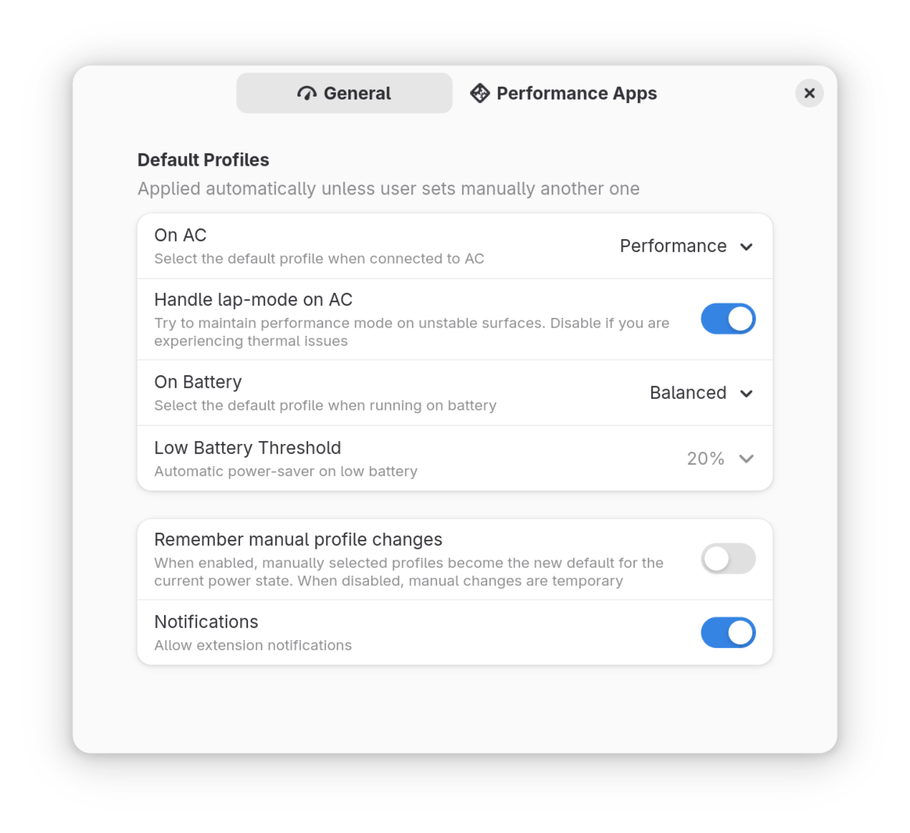

# Auto Power Profile

GNOME Shell extension to automatically switch between power profiles based on power supply status.

[](https://github.com/dmy3k/auto-power-profile/actions/workflows/tests.yml)

## Settings



When enabled, the extension will automatically switch to:

- the selected defaults profiles based on the which power supply the device is running on.
- to power saving profile if running on battery and the percentage drops below the selected level.

## Installation

### Dependencies

This extension depends on [`powerprofilesctl`](https://gitlab.freedesktop.org/upower/power-profiles-daemon),
which is a part of GNOME desktop in such distros as Fedora, Ubuntu.

In case you are using another distro this dependency should be installed manually.

### From Gnome Extensions store

This extension can be found in the [store](https://extensions.gnome.org/extension/6583/auto-power-profile/).

[](https://extensions.gnome.org/extension/6583/auto-power-profile/)

### Installation from source

Clone the repo, pack and install the extension.

```
# Clone repository
git clone https://github.com/dmy3k/auto-power-profile
cd auto-power-profile

# Build
gnome-extensions pack --podir=po --extra-source=ui

# Install and activate
gnome-extensions install --force auto-power-profile@dmy3k.github.io.shell-extension.zip
gnome-extensions enable auto-power-profile@dmy3k.github.io
```

Extension will appear in the list of extensions and will be activated after you logout and log back in.

## GNOME Version Support

This extensions is developed and tested on Fedora. Currrent plan is to support latest stable GNOME version with new features and bugfixes.

## Contribution

Contribution to this project are welcome

## Credits

This project was originally forked from [eliapasquali/power-profile-switcher](https://github.com/eliapasquali/power-profile-switcher) with goal to provide better support and stability.
