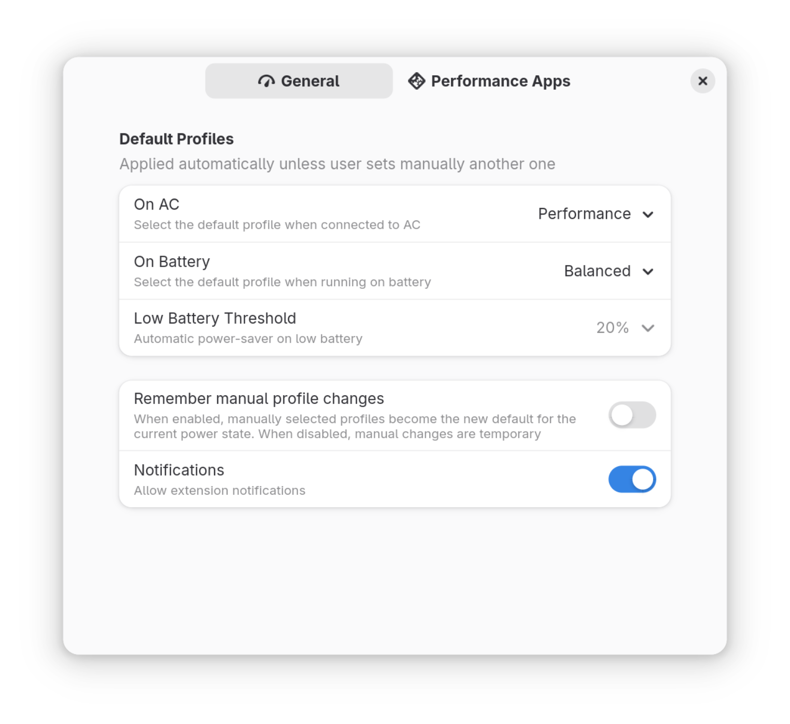

# Auto Power Profile

[](https://github.com/dmy3k/auto-power-profile/actions/workflows/tests.yml)

GNOME Shell extension to automatically switch between power profiles based on power supply status and battery level.

The extension offers alternative solution to long-standing
[feature request #715](https://gitlab.gnome.org/GNOME/gnome-settings-daemon/-/issues/715) in `gnome-settings-daemon` repo.

## Settings



## Installation

### Dependencies

This extension requires [`powerprofilesctl`](https://gitlab.freedesktop.org/upower/power-profiles-daemon) (used in most distros with Gnome desktop) or `tuned-ppd` (Fedora >= 40) package to operate.

### From Gnome Extensions store

This extension can be found in the [store](https://extensions.gnome.org/extension/6583/auto-power-profile/).

[](https://extensions.gnome.org/extension/6583/auto-power-profile/)

### From source

Typically this is needed for testing and development. Clone the repo, pack and install the extension.

```
# Clone repository
git clone https://github.com/dmy3k/auto-power-profile
cd auto-power-profile

# Build
glib-compile-schemas schemas/
gnome-extensions pack --podir=po --extra-source=ui --extra-source=lib

# Install and activate
gnome-extensions install --force auto-power-profile@dmy3k.github.io.shell-extension.zip
gnome-extensions enable auto-power-profile@dmy3k.github.io
```

Extension will appear in the list of extensions and will be activated after you logout and log back in.

### Translations

- re-generate `pot` file if you add new strings during development

```
xgettext \
    --from-code=UTF-8 \
    --package-name="Auto Power Profile" \
    --output="po/auto-power-profile.pot" \
    *.js \
    ui/*.ui
```

- create (e.g `cp po/auto-power-profile.pot po/es.po`) or edit corresponding `po` files, e.g with [Gtranslator](https://flathub.org/nb-NO/apps/org.gnome.Gtranslator)
- create pull request

## Contribution

Contribution to this project are welcome

## Credits

To the authors of [eliapasquali/power-profile-switcher](https://github.com/eliapasquali/power-profile-switcher), as current project was forked from it.
